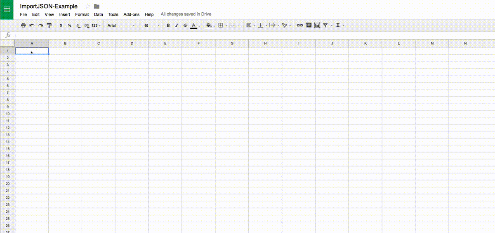

# How to import JSON data into Google Sheets

## Problem
Google YouTube API will return a query report by JSON, which has a `columnsHeaders` to describe the columns and a `rows` to contain the data table, looks like:
```javascript
{
 "kind": "youtubeAnalytics#resultTable",
 "columnHeaders": [
  {
   "name": "day",
   "columnType": "DIMENSION",
   "dataType": "STRING"
  },
  {
   "name": "views",
   "columnType": "METRIC",
   "dataType": "INTEGER"
  }
 ],
 "rows": [
  [
   "2017-07-01",
   18552.0
  ],
  [
   "2017-07-02",
   15696.0
  ],
  [
   "2017-07-03",
   21593.0
  ],
  ...
}
```

Google Analytics API reports the similar way. 

How can we import such JSON data into Google Sheets, where we could manipulate the data, e.g. doing calculation, making some charts.

## Solution
The most simplest way could be the `Tools` -> `Script editor`

Based on the awesome [ImportJSON] script, I added a new function [ImportHeaderRowsJSON].

I made a copy of the instructions from [How to import JSON data into Google Spreadsheets in less than 5 minutes]

1. Create a new Google Spreadsheet.
1. Click on Tools -> Script Editor.
1. Click Create script for Spreadsheet.
1. Delete the placeholder content and paste the code from [the script][ImportHeaderRowsJSON Raw](forked from [ImportJSON]).
1. Rename the script to ImportJSON.gs and click the save button.
1. Back in the spreadsheet, in a cell, you can type `=ImportHeaderRowJSON("https://raw.githubusercontent.com/touren/YouTube_API/master/query_report_view_by_day.json")`. The script will load the JSON data, parse it, format the columns and create a data table for you.
1. You can create a chart on it now.

Below is the demo gif:



## Reference
* [How to import JSON data into Google Spreadsheets in less than 5 minutes]

[How to import JSON data into Google Spreadsheets in less than 5 minutes]: https://medium.com/@paulgambill/how-to-import-json-data-into-google-spreadsheets-in-less-than-5-minutes-a3fede1a014a
[ImportHeaderRowsJSON Raw]: https://raw.githubusercontent.com/touren/YouTube_API/master/importJSON.gs
[ImportHeaderRowsJSON]: https://github.com/touren/YouTube_API/blob/master/importJSON.gs#L99
[ImportJSON]: https://gist.github.com/chrislkeller/5719258
